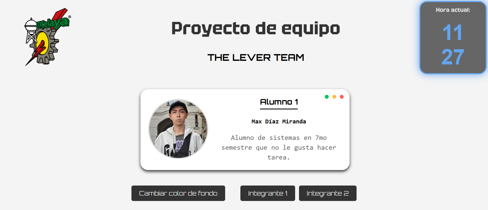

# 🌐 Actividad 1 Ingeniería de Software

Este repositorio contiene el desarrollo de un proyecto académico para la materia **Ingeniería de Software**.  
El objetivo es crear una página web utilizando **HTML, CSS y JavaScript**, donde se presentan los integrantes del equipo con su **fotografía y una breve descripción personal**.   

---

## 📌 Características
- Presentación de integrantes con foto y descripción.  
- Interfaz desarrollada con **HTML, CSS y JavaScript**.  
- Botón para **cambiar el color de fondo** de la página.
- Botón para **cambiar de estudiante**.
- Proyecto colaborativo con uso de **Git y GitHub** para control de versiones.  

---

## 🖥️ Interfaz

A continuación se muestra una vista previa de la interfaz desarrollada: 


<!--
---
## 🚀 Instalación y uso
1. Clonar el repositorio:  
   ```bash
   git clone https://github.com/usuario/nombre-del-repositorio.git
---
-->


